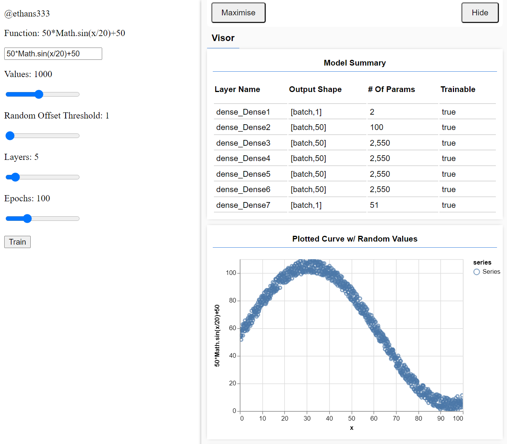
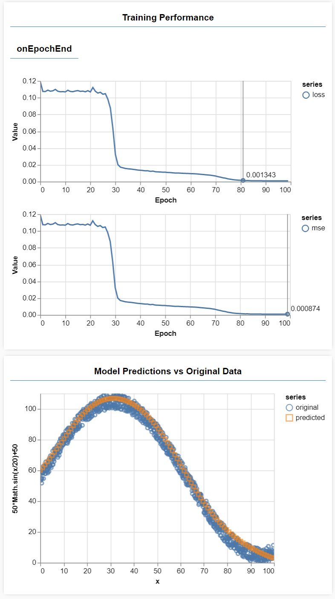

# curveMeanTensorFlow
Calculate the mean of a curve based on a dataset calculated from a function with random offset values. You can try it out [here](https://affectionate-bhaskara-eb23b5.netlify.app/).

